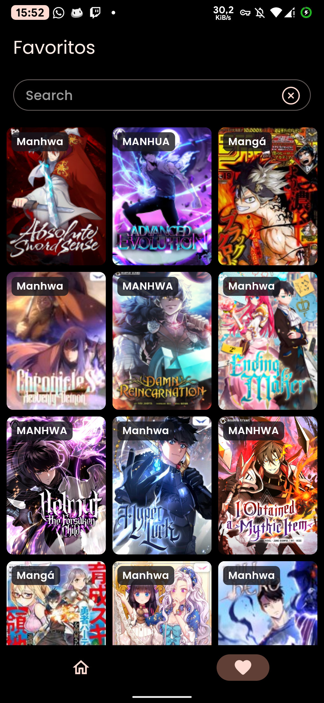

# JReader

## Screenshots

<p>
  
  
  
  
</p>

## Funcionalidades

- Contas Individuais - Google
- Leitura
- Pesquisa
- Favoritos
- Capítulos lidos
- Leitura offline - Download de capítulos

## Instalação

Clone o projeto

```bash
git clone https://github.com/joaojsrbr/JReader.git
```

Vá para o diretório do projeto

```bash
cd JReader
```

Instale as dependências

```bash
flutter pub get
```

Este aplicativo utiliza o **Firebase**. Para configura-lo, é so seguir os passos da [documentação oficial](https://firebase.google.com/docs/flutter/setup?hl=pt-br&platform=android).

Apos configurar o firebase, é so rodar o app com o comando

```bash
flutter run
```

### Estrutura de pastas

Aqui está a estrutura de pastas principal que o flutter fornece.

```
flutter-app/
|- android
|- build
|- ios
|- lib
```

Aqui está a estrutura de pastas que estamos usando neste projeto.

```
lib/
|- app/
  |- core/
  |- databases/
  |- generated/
  |- models/
  |- repository/
  |- routes/
  |- services/
  |- stores/
  |- ui/
  |- widgets/
  |- my_app.dart
|- main.dart
```

## Licença

[MIT](./LICENSE)
